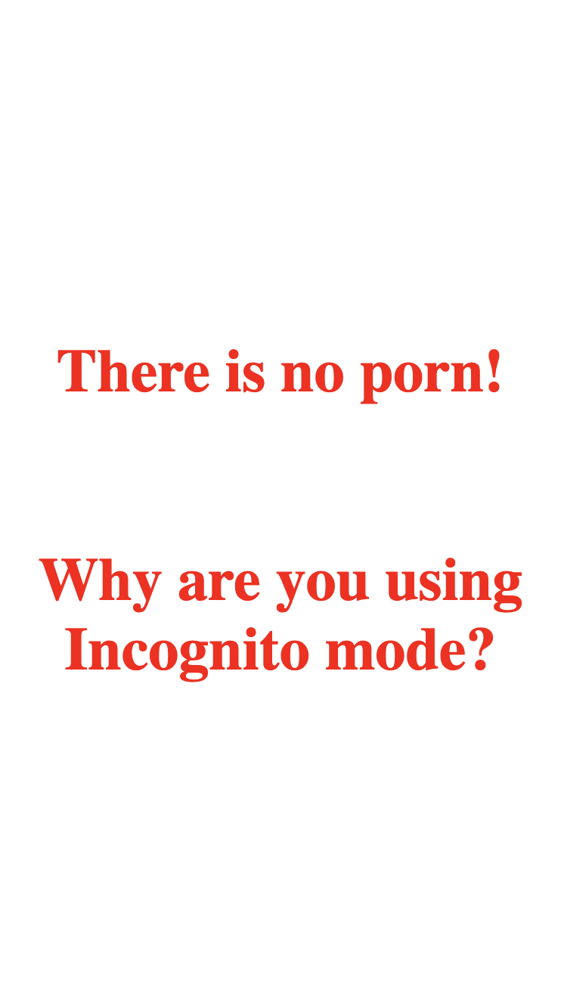
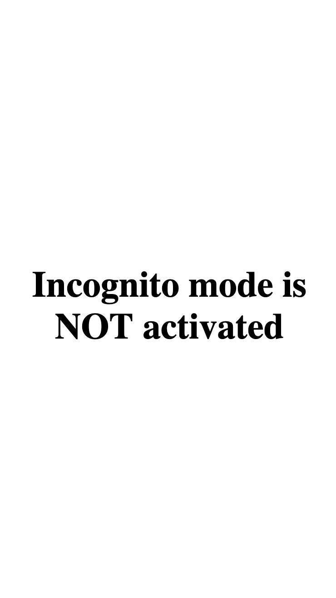

[](https://github.com/yankouskia/is-incognito/pulls) [](https://github.com/yankouskia/is-incognito/blob/master/LICENSE)

[](https://www.npmjs.com/package/is-incognito)

# is-incognito

👤Function to identify whether browser is in incognito mode 👀

## How to use

To install library:

```sh
# yarn
yarn add is-incognito

# npm
npm install is-incognito --save
```

```js
// ES6 modules
import isIncognito from 'is-incognito';

// CommonJS modules
const isIncognito = require('is-incognito').default;

/*
  Function returns Promise, which could be:
  - resolved with true, if Incognito mode is opened
  - resolved with false, if regular window is opened
  - rejected if no possibility to identify
*/
isIncognito()
  .then(isPrivate => {
    if (isPrivate) {
      alert('There is no porn! Why are you using Incognito mode?');
    } else {
      console.log('Incognito mode is NOT activated')
    }
  })
  .catch(e => {
    console.log(e.message);
  })
```


## Demo

[DEMO can be found here](https://yankouskia.github.io/is-incognito/example/index.html)


Incognito Window            |  Regular Window
:-------------------------:|:-------------------------:
  |  


## API

`isIncognito: Promise<boolean>`

Result `Promise` is
  - resolved with `true`, if Incognito mode is opened.
  - resolved with `false`, if regular window is opened
  - rejected if no possibility to identify


## Contributing

`is-incognito` is open-source library, opened for contributions


### License

`is-incognito` is [MIT licensed](https://github.com/yankouskia/is-incognito/blob/master/LICENSE)
