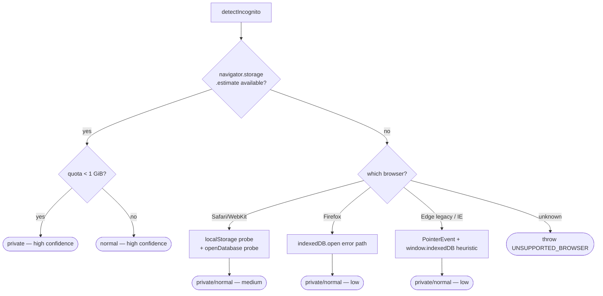

<div align="center">

# `is-incognito-mode`

### **Detect private / incognito browsing in 4 lines of code.**

_Zero dependencies — fully typed — dual ESM + CJS — ~1 kB gzipped._

[](https://www.npmjs.com/package/is-incognito-mode)
[](https://www.npmjs.com/package/is-incognito-mode)
[](https://github.com/yankouskia/is-incognito-mode/actions/workflows/ci.yml)
[](./coverage)
[](https://bundlephobia.com/package/is-incognito-mode)
[](./src/index.ts)
[](./LICENSE)

<br />

### **[Try the live demo →](https://yankouskia.github.io/is-incognito-mode/demo/)**

_Open it in a normal window. Then re-open it in private/incognito mode. Watch the verdict flip._

<br />

</div>

---

## 30-second tour

```sh
npm install is-incognito-mode
```

```ts
import { isIncognito } from 'is-incognito-mode';

if (await isIncognito()) {
  showPaywall();
} else {
  trackVisit();
}
```

That's it. **One async call, one boolean.** Works on Chrome, Firefox, Safari,
Edge, and (best-effort) the long tail of older WebKit shells.

Need more than a yes/no? Use [`detectIncognito()`](#rich-detection-result) for
a typed object with `browser`, `confidence`, `quota`, and `strategy` fields.

---

## Why you'd use this

Browsers don't expose a "private mode" API on purpose — but private windows
still leak the fact through **resource limits** and **storage shape**.
`is-incognito-mode` packages the current state-of-the-art detection (quota
probing via `navigator.storage.estimate()`) as a tiny, typed, zero-dep module,
so you can stop hand-rolling heuristics that browsers patched out in 2019.

A few real-world fits:

| Scenario                  | What you do                                                 |
| ------------------------- | ----------------------------------------------------------- |
| **Soft paywall**          | Discourage incognito bypass without hard-blocking the user. |
| **Respectful analytics**  | Skip beacon calls in private sessions to honor the signal.  |
| **Long forms / surveys**  | Warn before storing state that will vanish on close.        |
| **Fraud / abuse signals** | One input among many — never the sole decider.              |
| **E2E test conditioning** | Branch tests based on whether you're driving a private tab. |

---

## Install

```sh
pnpm add is-incognito-mode      # or  npm i is-incognito-mode
                                # or  yarn add is-incognito-mode
                                # or  bun add is-incognito-mode
```

**No-install — straight from a CDN**:

```html
<script type="module">
  import { isIncognito } from 'https://esm.sh/is-incognito-mode@2';
  console.log(await isIncognito());
</script>
```

---

## See it run

A ready-to-run demo page is hosted alongside the docs:

> **https://yankouskia.github.io/is-incognito-mode/demo/**

Open it once in a regular window, then once in incognito/private — the
verdict, browser, confidence, quota, and strategy update live.
Source: [`examples/browser/index.html`](./examples/browser/index.html) (single
static file, no build step).

---

## How it decides (under the hood)

The library tries the cleanest signal first and falls back to engine-specific
probes for older browsers. Click to expand:

<details>
<summary>Detection flow diagram</summary>


```mermaid
flowchart TD
    A[detectIncognito] --> B{navigator.storage<br/>.estimate available?}
    B -- yes --> C{quota &lt; 1 GiB?}
    C -- yes --> R1([private — high confidence])
    C -- no --> R2([normal — high confidence])
    B -- no --> D{which browser?}
    D -- Safari/WebKit --> E[localStorage probe<br/>+ openDatabase probe]
    D -- Firefox --> F[indexedDB.open error path]
    D -- Edge legacy / IE --> G[PointerEvent + window.indexedDB heuristic]
    D -- unknown --> X([throw UNSUPPORTED_BROWSER])
    E --> R3([private/normal — medium])
    F --> R4([private/normal — low])
    G --> R5([private/normal — low])
```

</details>

The default threshold is **1 GiB**. Modern Chromium incognito tabs report
quota in the **500 MiB–1 GiB** range (the cap was ~120 MiB pre-2022 but Chrome
raised it in 110+), and Firefox / Safari private modes are well below that.
Normal-mode quotas on a desktop are typically tens-to-hundreds of GiB, so the
margin is comfortable. Small-disk devices (low-end mobile, restricted ChromeOS
profiles) may produce false positives — override with
`privateQuotaThresholdBytes` if that matters to you.

---

## Usage

### Boolean verdict

```ts
import { isIncognito } from 'is-incognito-mode';

const inPrivate = await isIncognito();
```

### Rich detection result

```ts
import { detectIncognito } from 'is-incognito-mode';

const { isPrivate, browser, confidence, quota, strategy } =
  await detectIncognito();

console.log(
  `${browser} (${confidence}) — strategy: ${strategy}, quota: ${quota}`,
);
// → "chromium (high) — strategy: storage-quota, quota: 33554432"
```

Fields on `DetectionResult`:

| field        | type                          | notes                                                                                     |
| ------------ | ----------------------------- | ----------------------------------------------------------------------------------------- |
| `isPrivate`  | `boolean`                     | Final verdict.                                                                            |
| `browser`    | `BrowserName`                 | Coarse engine: `chromium`, `firefox`, `safari`, `webkit`, `edge-legacy`, `ie`, `unknown`. |
| `confidence` | `'high' \| 'medium' \| 'low'` | `high` for direct quota signal; `low` for legacy heuristics.                              |
| `quota`      | `number \| null`              | Total storage quota in bytes, when `storage.estimate()` was available.                    |
| `strategy`   | `DetectionStrategyName`       | Which probe produced the verdict.                                                         |

### Tuning the quota threshold

```ts
import {
  detectIncognito,
  DEFAULT_PRIVATE_QUOTA_BYTES,
} from 'is-incognito-mode';

const result = await detectIncognito({
  privateQuotaThresholdBytes: DEFAULT_PRIVATE_QUOTA_BYTES * 2,
});
```

Default is **1 GiB** (matches the band where current Chrome / Firefox /
Safari incognito sessions report quota). Lower it if you trust a tighter
threshold for your audience, or raise it on devices with very little physical
storage where normal mode itself may report less than 1 GiB.

### Injecting globals (for testing)

`detectIncognito` accepts a `globals` override so unit tests don't have to
monkey-patch `navigator` or `window`:

```ts
import { detectIncognito } from 'is-incognito-mode';

const result = await detectIncognito({
  globals: {
    navigator: {
      userAgent: 'Mozilla/5.0 ... Chrome/131.0',
      storage: {
        estimate: () => Promise.resolve({ quota: 32 * 1024 * 1024 }),
      },
    },
    window: {},
  },
});
// result.isPrivate === true
```

### Error handling

```ts
import { isIncognito, IncognitoDetectionError } from 'is-incognito-mode';

try {
  const incognito = await isIncognito();
  // ...
} catch (error) {
  if (error instanceof IncognitoDetectionError) {
    switch (error.code) {
      case 'NOT_A_BROWSER':
        // Server-side render path
        break;
      case 'UNSUPPORTED_BROWSER':
        // Probably a bot / curl / node-fetch
        break;
      case 'PROBE_FAILED':
        // Storage API rejected, no fallback applied
        break;
    }
  }
}
```

### CommonJS

```js
const { isIncognito } = require('is-incognito-mode');

// Default-import-style:
const detect = require('is-incognito-mode').default;
```

---

## API at a glance

| Export                          | Kind     | Description                                                                          |
| ------------------------------- | -------- | ------------------------------------------------------------------------------------ |
| `isIncognito(options?)`         | function | Resolves to `boolean`.                                                               |
| `detectIncognito(options?)`     | function | Resolves to a rich `DetectionResult`.                                                |
| `IncognitoDetectionError`       | class    | Typed error with `code: 'NOT_A_BROWSER' \| 'UNSUPPORTED_BROWSER' \| 'PROBE_FAILED'`. |
| `DEFAULT_PRIVATE_QUOTA_BYTES`   | const    | Default threshold (`120 × 1024 × 1024`).                                             |
| `BrowserName` (type)            | type     | Coarse engine name.                                                                  |
| `DetectionResult` (type)        | type     | Rich result shape — see "Usage".                                                     |
| `DetectionConfidence` (type)    | type     | `'high' \| 'medium' \| 'low'`.                                                       |
| `DetectionStrategyName` (type)  | type     | Strategy identifier.                                                                 |
| `DetectIncognitoOptions` (type) | type     | Options bag.                                                                         |

Full generated reference: **<https://yankouskia.github.io/is-incognito-mode/>**

---

## Compatibility

### Browsers

| Engine                 | Detection strategy              | Confidence |
| ---------------------- | ------------------------------- | ---------- |
| Chromium ≥ 80          | `navigator.storage.estimate`    | high       |
| Firefox ≥ 75           | `navigator.storage.estimate`    | high       |
| Safari ≥ 13            | `navigator.storage.estimate`    | high       |
| Older Safari / WebKit  | `localStorage` + `openDatabase` | medium-low |
| Older Firefox          | `indexedDB.open` error path     | low        |
| Edge (legacy)          | `PointerEvent` heuristic        | low        |
| IE 10–11               | `PointerEvent` heuristic        | low        |
| All others (`unknown`) | throws `UNSUPPORTED_BROWSER`    | —          |

### Node / runtimes

Not supported at runtime — this is a **browser-only** package and will throw
`NOT_A_BROWSER` if invoked without a `navigator`. The package _builds_ on
Node ≥ 20.

### Bundlers & frameworks

Ships ESM and CJS with proper `exports` map and `.d.ts` / `.d.cts`. Works
out-of-the-box in Vite, Next.js (client components), Remix, Astro, Webpack,
Rollup, esbuild, Bun, and Deno.

---

## What's new in v2

|                     | v1.x                                                     | v2.0                                                         |
| ------------------- | -------------------------------------------------------- | ------------------------------------------------------------ |
| Detection technique | FileSystem API + IndexedDB + localStorage + PointerEvent | `navigator.storage.estimate()` quota (with legacy fallbacks) |
| TypeScript          | shipped JS only                                          | strict TypeScript source, full `.d.ts`                       |
| Module formats      | UMD + CJS                                                | ESM + CJS dual publish                                       |
| Dependencies        | `get-browser`                                            | **zero**                                                     |
| Bundle size         | ~3 kB min+gzip                                           | **~1 kB min+gzip**                                           |
| Engines             | Node ≥ 8                                                 | Node ≥ 20                                                    |
| Error model         | `throw 'string'`                                         | `IncognitoDetectionError` with `code`                        |

See [`BREAKING_CHANGES.md`](./BREAKING_CHANGES.md) for migration recipes
and [`DECISIONS.md`](./DECISIONS.md) for the reasoning behind each big call.

---

## Comparison with alternatives

- **[`detectincognitojs`](https://github.com/Joe12387/detectIncognito)** —
  excellent, similar in spirit. Pick that if you want a UMD bundle or a richer
  per-browser breakdown.
- **Inline UA sniff + `try/catch` around `localStorage`** — broken in every
  modern browser. Don't.
- **Just check `window.webkitRequestFileSystem`** — patched out of Chrome 76.
  Don't.

---

## Contributing

Pull requests welcome. See [`CONTRIBUTING.md`](./CONTRIBUTING.md) for the dev
loop, conventional commits, and the changeset workflow. Be excellent — the
[Contributor Covenant 2.1](./CODE_OF_CONDUCT.md) applies.

## Security

Report vulnerabilities privately per [`SECURITY.md`](./SECURITY.md).

## License

[MIT](./LICENSE) © Aliaksandr Yankouski
